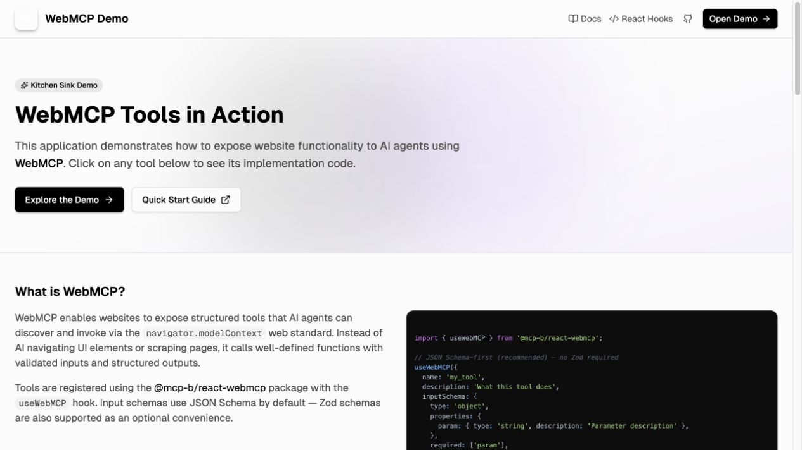

# I Built a Voice Agent That Can Use the Tools on the Page You Are Already Viewing

**Draft title:** Give Your Voice Agent Hands: A Local WebMCP Bridge for the Browser

**Suggested deck:** A small local bridge lets a realtime voice agent discover the tools a web page explicitly exposes, ask for approval when needed, and return the result to the conversation.

Most voice assistants can talk about the web. Fewer can do something useful *on the page you already have open*—and fewer still make it obvious which action they are about to take.

That is the problem I wanted to explore with **Voice-Driven WebMCP Bridge**: a local, browser-based voice agent that discovers WebMCP tools from a page, routes tool calls through a bookmarklet, and keeps a human in the loop.

The result feels less like dictating into a search box and more like giving your browser a carefully supervised pair of hands.

## What it is

Voice-Driven WebMCP Bridge is an experimental local stack with four small pieces:

| Piece | What it does |
|---|---|
| Voice agent UI | Captures microphone audio, connects to a realtime speech-to-speech backend, shows the transcript, tools, calls, and results. |
| Local bridge | Routes JSON between the voice agent and a paired browser tab on `localhost`. It is deliberately not a tool executor. |
| Bookmarklet | Runs in the tab you choose, reads the page-provided WebMCP tool catalog, and invokes only those tools. |
| Realtime backend | Handles speech recognition, language-model reasoning, function selection, and speech output. In my setup this is a local-compatible realtime service. |

The key idea is simple: the webpage decides what capabilities it exposes. The bridge does not scrape buttons, infer hidden APIs, or invent browser powers. If the page exposes a WebMCP tool such as `get_current_context`, `list_all_routes`, or `add_to_cart`, the voice agent can be told about that tool and can request its use.

## A public example you can try today

The public [WebMCP Demo](https://webmcp.sh/) is a useful way to see the idea without connecting to a private app. Its landing page exposes a small catalog of tools, including read-only calls such as `get_current_context`, `list_all_routes`, and `app_gateway`, plus a `navigate` action for moving between routes. As the page context changes, it can expose more focused tools for that view.



*The public WebMCP Demo at webmcp.sh. The page itself exposes structured tools that an agent can discover rather than requiring the agent to scrape the interface.*

This makes for an easy first voice test: pair the tab, leave its tools on Require approval, then ask, “Use `get_current_context`, then tell me the current route.” You can see the exact function input before allowing the browser-side tool to run.

## Why this is interesting

The browser is where much of our work already happens: support dashboards, internal tools, commerce sites, admin panels, travel planners, docs, and developer consoles. Those pages carry context that is awkward to repeatedly explain to a general-purpose assistant.

WebMCP gives a page a way to describe its own useful actions as structured tools. A realtime voice agent adds a natural interface on top:

> “What route am I looking at?”
>
> “Find the open customer ticket and summarize the latest reply.”
>
> “Add this item to the cart—but ask me before submitting anything.”

The useful part is not merely voice control. It is **grounded control**: the model receives a typed tool schema supplied by the active page, produces structured arguments, and receives a structured result back. That is much more reliable than asking a model to guess at the page’s visual layout.

## The safety model matters as much as the demo

Giving an assistant access to actions is where a charming demo can become a bad product. So the project makes the action boundary visible.

Each discovered tool starts as **Require approval**. When the model asks to call one, the Tool Inspector shows the exact tool name and JSON input before anything runs. You can approve or decline the specific call.

For familiar, low-risk actions, tools can be configured as **Auto-run**. Those preferences are stored locally and scoped to the combination of page origin and tool name. The Tool Blueprint also supports checkboxes, so a group of known-safe tools can be set to Auto-run together. That configuration affects future calls only; it does not silently release calls that are already waiting for approval.

This provides a practical middle ground:

| Tool category | Suggested policy | Example |
|---|---|---|
| Read-only context | Auto-run after testing | Read the active route or current filter. |
| Reversible changes | Require approval | Add a draft item or update a form field. |
| Irreversible or sensitive actions | Require approval, with careful review | Submit, purchase, delete, send, or modify account data. |

The pairing model adds another boundary. The web app generates a six-digit code; the bookmarklet must enter that code before its tab is associated with that particular voice-agent session. The bridge then routes calls only to the selected paired tab, not every browser tab on the machine.

It is worth being clear about what this is *not*: it is not a way to grant arbitrary powers to any website. It depends on WebMCP support in the browser and on tools a page has intentionally exposed. It is also designed for a local development setup—do not put the bridge or realtime backend on the public internet without proper authentication and TLS.

## How a voice request becomes a page action

Here is the end-to-end flow:

1. You open a WebMCP-enabled page and run the bookmarklet.
2. The bookmarklet asks the page for its tool definitions and sends them through the local bridge.
3. The voice UI displays those tools as a visual blueprint and sends standard function schemas to the realtime model.
4. You speak a request. The model decides whether a page tool helps and emits a function call with JSON arguments.
5. The UI either pauses for your approval or routes the call immediately according to that tool’s policy.
6. The bookmarklet invokes the page’s tool and returns a structured result or error.
7. The UI feeds that result back to the model, which can explain the outcome in speech and in the rolling transcript.

The bridge message itself stays intentionally boring. For example, the agent sends:

```json
{
  "type": "EXECUTE_TOOL",
  "callId": "call_abc123",
  "toolName": "addToCart",
  "params": { "itemId": "sku_999" }
}
```

The paired page answers with either a `TOOL_RESULT` or `TOOL_ERROR`. Keeping the router payload-agnostic makes it easier to inspect and evolve without turning the Node process into a second model or a hidden policy engine.

## What you need to provide

The repository includes the browser bridge, bookmarklet, and voice UI. It does
not include a hosted speech-to-speech service. To run the voice path, you need
an OpenAI-Realtime-compatible endpoint that you operate or are authorized to
use. The project was tested with a self-hosted
[Hugging Face speech-to-speech](https://github.com/huggingface/speech-to-speech)
server. Do not expose either the local bridge or the inference backend to the
public internet without authentication and TLS.

## How to try it yourself

This project is intentionally small: Node.js for the bridge, a vanilla JavaScript bookmarklet, and a React/Vite frontend. You will need a WebMCP-capable Chromium setup, a page that exposes WebMCP tools, and a realtime backend compatible with the frontend’s event contract.

Start the local pieces:

```sh
git clone https://github.com/higeshogun/voice-webmcp-bridge.git
cd voice-webmcp-bridge
npm install
npm run build:bookmarklet
npm run start:bridge
```

In a second terminal, configure and start the voice UI:

```sh
cp voice-agent/.env.example voice-agent/.env
npm run start:agent
```

Then:

1. Open the Vite URL, usually `http://127.0.0.1:5173`.
2. Copy the generated bookmarklet URI from `bookmarklet/bookmarklet.txt` into a browser bookmark.
3. Open the public [WebMCP Pizza Maker demo](https://googlechromelabs.github.io/webmcp-tools/demos/pizza-maker/), the repository’s recommended first test. `https://webmcp.sh/` is a useful alternate page for a read-only call such as `get_current_context`.
4. Copy the six-digit pairing code from the voice UI, run the bookmarklet in that tab, and enter the code.
5. Choose the discovered tab in the UI, inspect the Tool Blueprint, and leave new tools on Require approval at first.
6. Start the voice agent and say: “Set the pizza size to Large.” Confirm that the Tool Inspector shows the exact `set_pizza_size` input before approving it.

The repository includes a more complete [manual test guide](MANUAL_TEST.md), including browser setup, expected events, and troubleshooting.

## A few details that make the experience feel better

Realtime voice interfaces live or die by timing. The frontend streams microphone input to the realtime backend, plays PCM output at the configured sample rate, and keeps a rolling transcript alongside the action history. It also supports barge-in: when you start speaking again, server voice activity detection can stop queued assistant audio and cancel the active response. That makes the interaction feel conversational instead of like a walkie-talkie that you have to wait out.

The Tool Inspector is just as important. Spoken interactions are transient; a visual record is not. Seeing the input and output for each tool call makes debugging easier, builds trust, and gives you a concrete audit trail while you iterate on page tools and prompts.

## Where I want to take it next

The foundation is deliberately local and narrow. The next interesting problems are not “more agent autonomy”; they are better boundaries and better ergonomics:

- named policy profiles for different work contexts;
- clearer risk labels supplied by pages alongside tool schemas;
- richer tool-call timelines and exportable session logs;
- authenticated local TLS for cases where a secure browser origin is required; and
- more pages exposing focused, well-described WebMCP tools.

That last point is the real invitation. The more websites expose small, intentional, typed capabilities, the less an assistant needs to guess. And when it does have the ability to act, the user can see exactly what that ability is, decide when it is trusted, and stay in control.

For now, Voice-Driven WebMCP Bridge is a proof of a simple idea: voice agents become dramatically more useful when they can work with the context already in front of you—and dramatically more trustworthy when their actions remain inspectable, scoped, and interruptible.
